## Multi-Tenancy Architecture in Kubernetes ##

**Concept of multi tenancy**: In kubernetets, multi-tenancy is when multiple users share a single cluster.

A common strategy among organizations is to use a single Kubernetes cluster that consists of multiple workloads sharing the platform’s infrastructure, which helps minimize the cost of running the cluster, as well as the amount of management needed. This arrangement is referred to as multi-tenancy.

Multi-tenant Kubernetes is a Kubernetes deployment where multiple applications or workloads run side-by-side.

Multi-tenancy is a common architecture for organizations that have multiple applications running in the same environment, or where different teams (like developers and IT Ops) share the same Kubernetes environment.

**Challenges**: To make ensure sufficiently isolated, access to the resources they need

Each workload must be isolated so that a security vulnerability or breach in one workload doesn’t spill over into another. Likewise, each workload must have fair access to the compute, networking, and other resources provided by Kubernetes

**Use Cases for Multi-Tenancy**:
- Managing cluster costs
- Accommodating trusted and untrusted tenants
- Reduce operational overhead and complexity

**Working Model Approach**:
I will perform this using `Namespace, RBAC, Network Policy, Quota`. For this i will primarly require a k8s Cluster.

I have set up this on my own k8s cluster created in virtual box. Taken one master node and one worker node.

**Master Node IP: 192.168.1.50**            
`2 CPU & 4GB RAM`

**Worker Node IP: 192.168.1.53**            
`3 CPU & 4GB RAM`

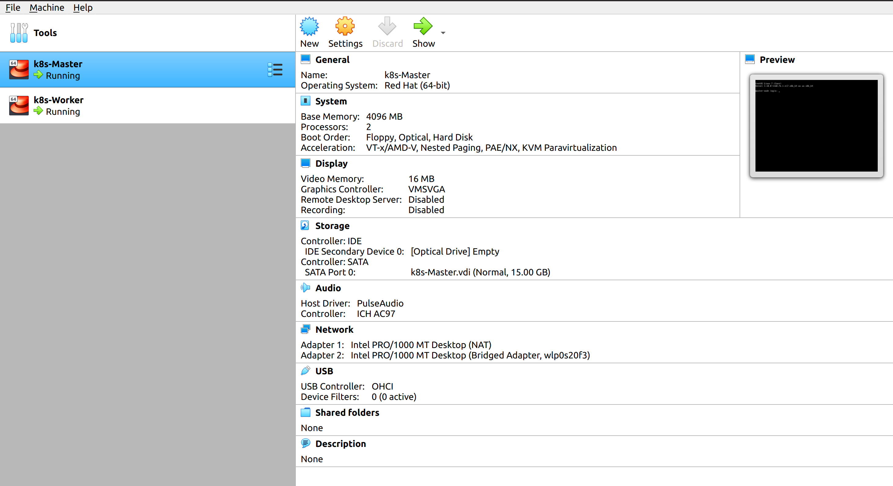

I have taken Centos7 Image to create these two VMs, Also installed & configured kubernetes latest 1.25 version using `kubeadm`.

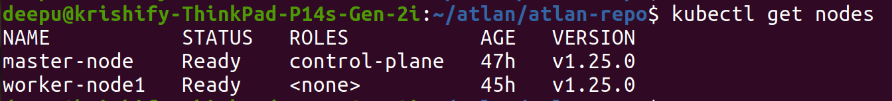

I have configured weave-net for networking inside cluster, metallb for load balancer configuration. Also i have installed ArgoCD and will perform this using a fully gitops method.
Also i have made two docker images for both tenants to check application from outside of cluster (as a customer) and deployed for both Clinet1 & Client2 along with service type as LoadBalancer. I will show this thing at last of the step.

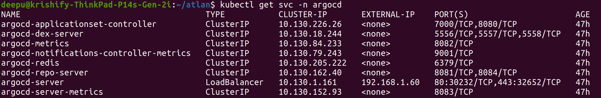

I have added two folders for two tenants as Client1 and Client2 with their own yaml manifest. These yamls have applied as admin of cluster, Also deployed sample web app for these two tenants with 2 replicas of pods, so that we can test network accessbility within NS and outside NS. As you can see all yamls have applied for client1 & client2.

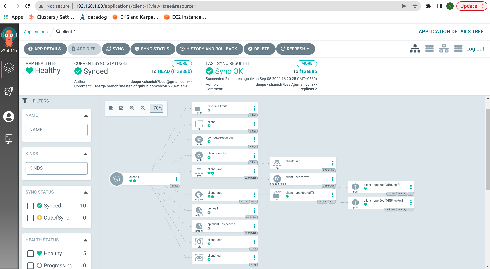

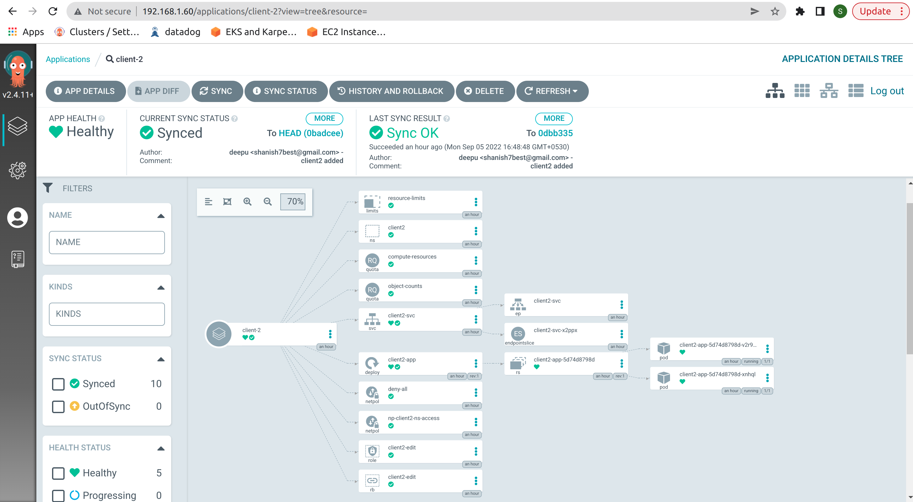

As you can get pods of Client1 below, IPs are `10.32.0.3` and `10.32.0.11` and service LB IP is `192.168.1.61`

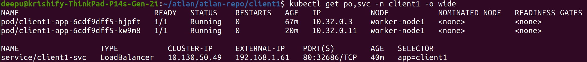

Now you can get pods of Client2 below, IPs are `10.32.0.18` and `10.32.0.17` and service LB IP is `192.168.1.62`

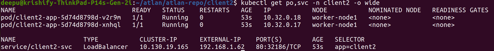

Now we will check Network Connectivity of Pods within same tenant's NS or different tenant's NS.

I have login into Client1 first pod `10.32.0.3` and will try to ping/curl on another pod `10.32.0.11` in same NS, It should be accessible. Check below

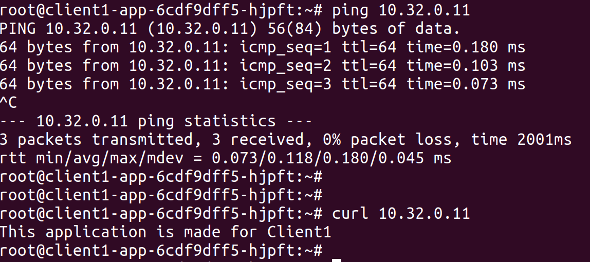

But, when i will try to ping/curl on different tenant's (Client2) pod, it should not accessible. Check below

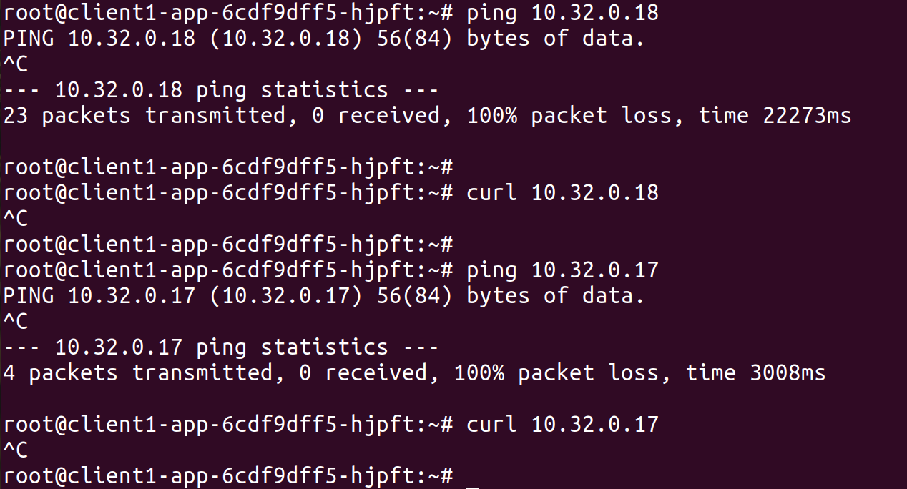

As expected we are not able to access Client2 pods from Client1.

Now I will check from Client2 pods in similar way, I have login into Client2 first pod `10.32.0.18` and will try to ping/curl on another pod `10.32.0.17` in same NS, It should be accessible. Check below

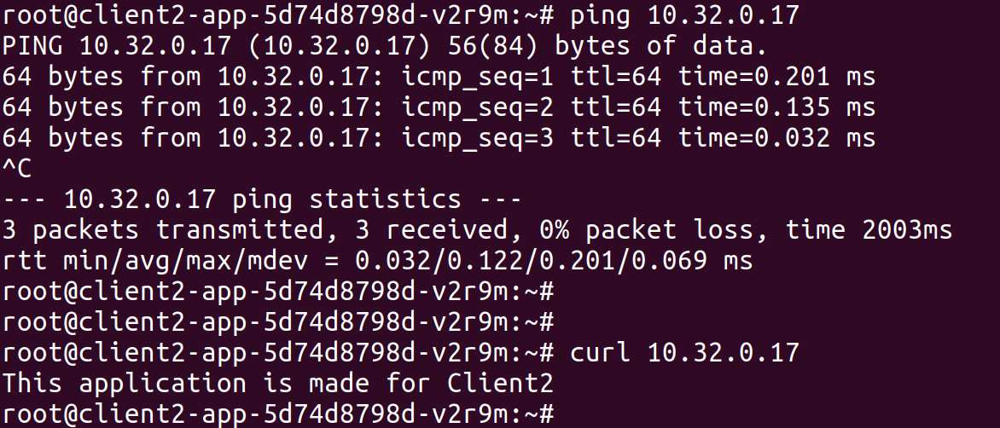

But, when i will try to ping/curl on different tenant's (Client1) pod, it should not accessible. Check below

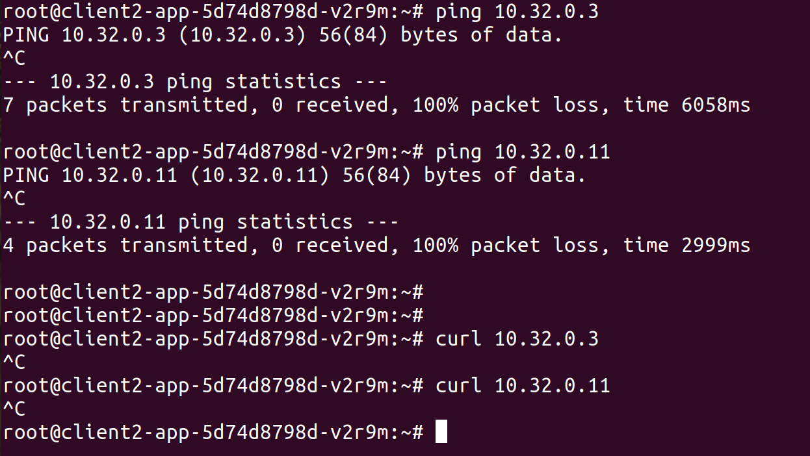


Also I have retrcited access for both tenants in their own Namespace only, they can't even view any other resources inside other's Namespace.

I have created user certificate to get access through `kubectl`, below are the steps written to create user/groups to access API server.

I have copied files `ca.crt` and `ca.key` from Master Node, to create custom user's auth certificate file. You can refer this path `cluster-resources/tenant-user`

**Steps followed for Client1**

```
mkdir -p  ~/.kube/users && cd ~/.kube/users

openssl genrsa -out client1.key 2048

openssl req -new -key client1.key -out client1.csr -subj "/CN=client1/O=tenant1"        // created a group tenant1

openssl x509 -req -CA /home/deepu/atlan/tenant-user/ca.crt -CAkey /home/deepu/atlan/tenant-user/ca.key -CAcreateserial -days 730 -in client1.csr -out client1.crt
```
Now here I have two files created for Client1 (`client1.crt` & `client1.key`), It will be required to setup context to access API server using kubectl for Client1.

```
kubectl config set-credentials client1 --client-certificate=client1.crt --client-key=client1.key

kubectl config get-contexts

kubectl config use-context client1-kubernetes
```

When successfully setup it will look like as below (I have setup `kubectx` in my localhost to switch contexts in easy way)

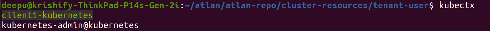

Similarly, we can follow above steps for other tenants.

You can see here, I have tried to list pods in client1 NS and other NS as user client1. See below result output

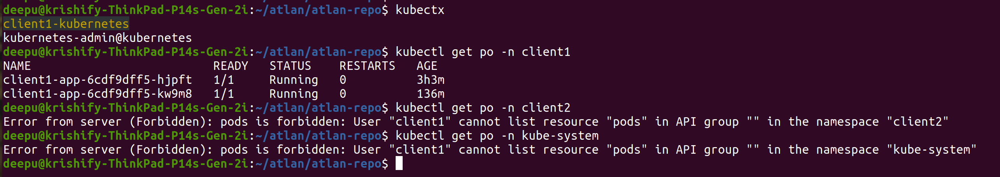

It can only access resources in their own NS only.

Now at final, we can test both tenant's web app is running fine or not as a customer.

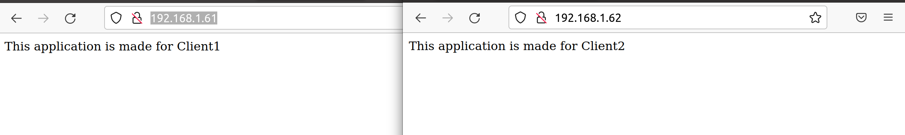

You can see, everything is running fine and according to our expectation.

**Thank You**
