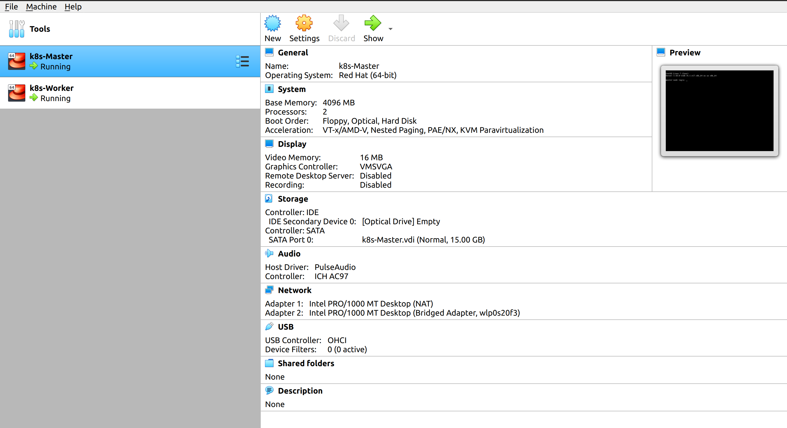
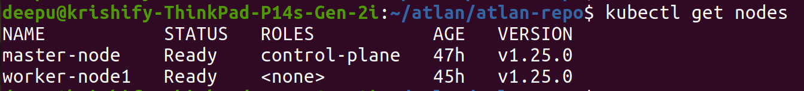
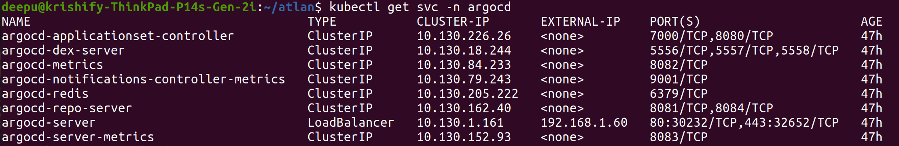
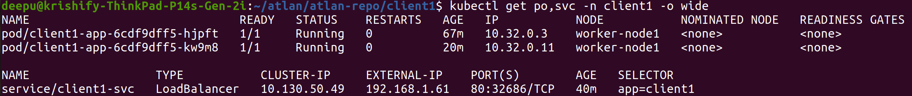

## Multi-Tenancy Architecture in Kubernetes ##

**Concept of multi tenancy**: In kubernetets, multi-tenancy is when multiple users share a single cluster.

A common strategy among organizations is to use a single Kubernetes cluster that consists of multiple workloads sharing the platform’s infrastructure, which helps minimize the cost of running the cluster, as well as the amount of management needed. This arrangement is referred to as multi-tenancy.

Multi-tenant Kubernetes is a Kubernetes deployment where multiple applications or workloads run side-by-side.

Multi-tenancy is a common architecture for organizations that have multiple applications running in the same environment, or where different teams (like developers and IT Ops) share the same Kubernetes environment.

**Challenges**: To make ensure sufficiently isolated, access to the resources they need

Each workload must be isolated so that a security vulnerability or breach in one workload doesn’t spill over into another. Likewise, each workload must have fair access to the compute, networking, and other resources provided by Kubernetes

**Use Cases for Multi-Tenancy**:
- Managing cluster costs
- Accommodating trusted and untrusted tenants
- Reduce operational overhead and complexity

**Working Model Approach**:
I will perform this using `Namespace, RBAC, Network Policy, Quota`. For this i will primarly require a k8s Cluster.

I have set up this on my own k8s cluster created in virtual box. Taken one master node and one worker node.

**Master Node IP: 192.168.1.50**            
`2 CPU & 4GB RAM`

**Worker Node IP: 192.168.1.53**            
`3 CPU & 4GB RAM`

I have taken Centos7 Image to create these two VMs, Also installed & configured kubernetes latest 1.25 version using `kubeadm`.

I have configured weave-net for networking inside cluster, metallb for load balancer configuration. Also i have installed ArgoCD and will perform this using a fully gitops method.

I have added two folders for two tenants as Client1 and Client2 with their own yaml manifest. These yamls have applied as admin of cluster, Also deployed sample web app for these two tenants with 2 replicas of pods, so that we can test network accessbility within NS and outside NS. As you can see all yamls have applied for client1.

As you can get pods of Client1 below, IPs are `10.32.0.3` and `10.32.0.11` and service IP is `192.168.1.61`

